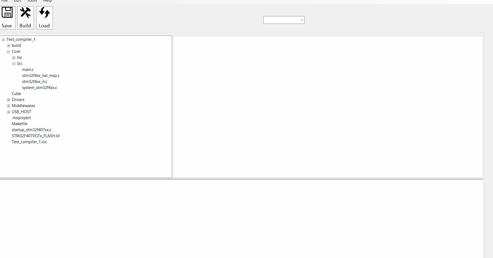

# WinFormsApp_ide

<!-- PROJECT LOGO -->


  <h1 align="center">STM32 IDE built-in with C#</h1>


<!-- TABLE OF CONTENTS -->
<details>
  <summary>Table of Contents</summary>
  <ol>
    <li>
      <a href="#about-the-project">About The Project</a>
      <ul>
        <li><a href="#built-with">Built With</a></li>
      </ul>
    </li>
    <li>
      <a href="#getting-started">Getting Started</a>
      <ul>
        <li><a href="#prerequisites">Prerequisites</a></li>
        <li><a href="#installation">Installation</a></li>
      </ul>
    </li>
    <li><a href="#usage">Usage</a></li>
    <li><a href="#roadmap">Roadmap</a></li>
    <li><a href="#contributing">Contributing</a></li>
    <li><a href="#license">License</a></li>
    <li><a href="#contact">Contact</a></li>
  </ol>
</details>


 
## About The Project

WinFormsApp IDE is a powerful Integrated Development Environment designed specifically for STM32 microcontroller development. Built using C# and incorporating ScintillaNET for advanced text editing features, this IDE offers an intuitive and efficient platform for coding, debugging, and managing STM32 projects. Key features include serial port management, automatic device detection, syntax highlighting, and easy project navigation.

<div align="center">
  <a>
    
  </a>
</div> 


Here's why:
* **Optimized for STM32:** Unlike generic IDEs, WinFormsApp IDE is tailored specifically for STM32 development, offering features and functionalities that align with the needs of STM32 programmers.
* **Advanced Serial Port Management:** Thanks to System.IO.Ports, our IDE offers sophisticated tools for managing serial communications, crucial for microcontroller programming and data transfer.
* **Real-Time Device Management:** Utilizing System.Management, the IDE provides real-time monitoring and management of connected STM32 devices, enhancing the development workflow.
* **Customized User Experience:** Built with user experience in mind, the IDE boasts a customizable interface, syntax highlighting, and other features that make coding more intuitive and less prone to errors.
* **Streamlined Workflow:** With integrated tools for editing, compiling, and debugging, developers can manage their entire STM32 project lifecycle within a single environment.
* **Community and Open Source Spirit:** Being open-source, it’s continuously evolving with contributions from a community passionate about STM32 development.

<p align="right">(<a href="#readme-top">back to top</a>)</p>

### Key Features

* **Customized STM32 Development Environment:** Tailored specifically for STM32 projects, offering specialized tools and features for these microcontrollers such as Directory Tree.

      

* **Real-Time Serial Port Management:** Efficient communication with STM32 devices, including automatic detection and management of serial connections.


* **Advanced Code Editor Building the program:** Integrating ScintillaNET for an enhanced coding experience with features like syntax highlighting, code folding, and auto-completion specifically tuned for C#. and control over connected STM32 devices, enhancing the development and debugging process.


* **Integrated Programming Tools:** Streamlined tools for building and debugging STM32 applications directly within the IDE, simplifying the development workflow.


### Built With

 In this project, I have used some C# libraries. These libraries can be added by using Nuget Package installer.

* **C#** - Programming language
* **.NET 6.0** - Framework
* **[CliWrap](https://github.com/Tyrrrz/CliWrap)**- Library for running command-line processes
* **[ScintillaNET](https://github.com/jacobslusser/ScintillaNET)** - Text editor component
* **[System.Management](https://www.nuget.org/packages/System.Management/)**  - Namespace for handling events
* **[System.IO.Ports](https://www.nuget.org/packages/System.IO.Ports/)** - Namespace for managing serial ports

Moreover, it is necessary to use some softwares for building and loading C embedded code. 

* **[OpenOCD](https://openocd.org/)** - On-chip programmer
* **[ST-Link CLI](https://www.st.com/en/development-tools/stsw-link004.html)** - Software interface for programming STM32 microcontrollers.
  
<p align="right">(<a href="#readme-top">back to top</a>)</p>


<!-- GETTING STARTED -->
## Getting Started
<!-- 
This is an example of how you may give instructions on setting up your project locally.
To get a local copy up and running follow these simple example steps.
-->
### Prerequisites

* Windows Operating System
* .NET 6.0 or later
* Required libraries: ScintillaNET, CliWrap, etc.
* ST-LINK drivers for STM32 microcontroller programming

### Installation

1. Clone the repository: ``` git clone https://github.com/AlirezaBeigiMech/STM32_IDE/ ```
2. Navigate to the cloned directory.
3. Open the solution file in Visual Studio.
4. Restore NuGet packages and build the solution.
5. Run the application from Visual Studio or build an executable.

<p align="right">(<a href="#readme-top">back to top</a>)</p>


<!-- USAGE EXAMPLES -->
## Usage

* **Creating a New Project:** Click on 'New Project' and select the project type suitable for STM32 development.
* **Opening Existing Projects:** Use the 'Open Project' option to load existing projects into the IDE.
* **Editing Code:** The ScintillaNET editor provides syntax highlighting and other text editing features.
* **Compiling and Debugging:** Integrated tools for compiling and debugging STM32 code.
* **Serial Port Management:** Automatically detect and manage serial ports for connected STM32 devices.


<!-- ROADMAP -->
## Roadmap

- [x] Add directory tree for adding the file in code editor
- [x] Add code editor 
- [x] Add multi-device Management port
- [x] Add saving feature to save the change in *.c files
- [x] Add Multi-tab feature 
- [x] Add Textbox to monitor the application
- [x] Add connection to CLI to perform command
- [x] Add responsive page 
- [x] Add load feature to program the microcontroller
- [ ] Add new file handling
- [ ] Add shortcut handling
- [ ] Add new directory tree
- [ ] Add auto-complete feature
- [ ] Modify tab features
    - [ ] Remove star if change is remove
    - [ ] Add close button
    - [ ] Add autoscale Maximize and minimize
<p align="right">(<a href="#readme-top">back to top</a>)</p>


<!-- CONTRIBUTING -->
## Contributing

Contributions are what make the open source community such an amazing place to learn, inspire, and create. Any contributions you make are **greatly appreciated**.

If you have a suggestion that would make this better, please fork the repo and create a pull request. You can also simply open an issue with the tag "enhancement".
Don't forget to give the project a star! Thanks again!

1. Fork the Project
2. Create your Feature Branch (`git checkout -b feature/AmazingFeature`)
3. Commit your Changes (`git commit -m 'Add some AmazingFeature'`)
4. Push to the Branch (`git push origin feature/AmazingFeature`)
5. Open a Pull Request

<p align="right">(<a href="#readme-top">back to top</a>)</p>


<!-- LICENSE -->
## License
 
Distributed under the MIT License. See `LICENSE.txt` for more information.

<p align="right">(<a href="#readme-top">back to top</a>)</p>


<!-- CONTACT -->
## Contact

Your Name - alirezabeigimech@gmail.com, alireza_beigi@sfu.ca

Project Link: [AlirezaBeigiMech/STM32_IDE](https://github.com/AlirezaBeigiMech/STM32_IDE)

<p align="right">(<a href="#readme-top">back to top</a>)</p>


